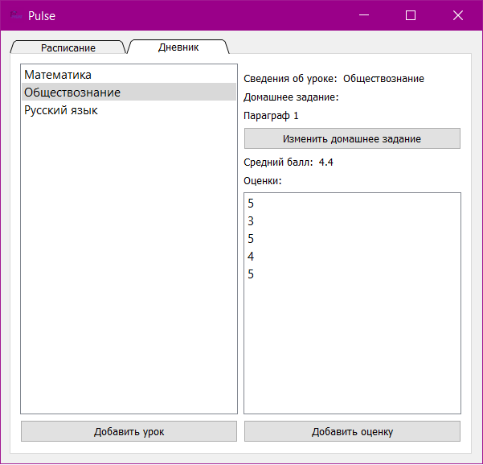
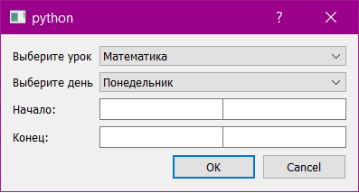
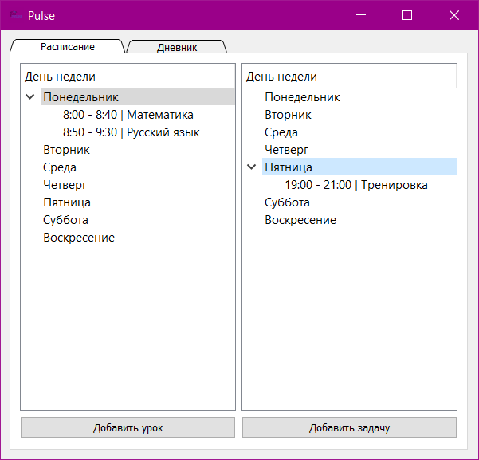

Hello! You use my application for effective
time planning! Thank you for choosing it!
## Instruction
The Pulse interface includes 2 tabs: Schedules and Diary.  
You can add lessons to the diary tab, there you will see the average score for  
lesson, homework, and your grades. Ratings can also be added.  
  
In the schedule tab, you can add lessons that are in your diary  
to the left schedule and your other activities to the right. To do this, in the dialog box that opens after clicking the button  
you will need to choose a day, a lesson and specify the time.  

### Attention!
The project has not been fully implemented, so deleting lessons from the application interface is not yet available.
